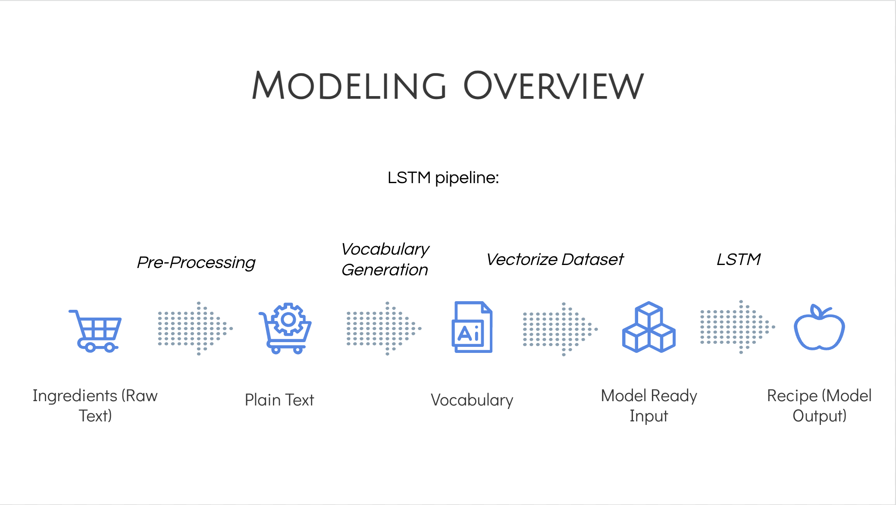

# NLPRecipeGenerator

## Overview

We live in an era of food waste and with rising costs of goods, many people are interested in ways they can save on grocery spending. 

We propose an AI solution that can take as input a list of groceries and then generate a recipe.

The intended use would be for someone to input a list of leftover groceries and then be provided with a recipe that is cookable. 

We used the Recipe Box dataset which consists of approximately 125,000 recipes scraped from food websites.

Each recipe is multi-structured, each providing additional information about the recipe.

Our dataset and model can be downloaded via the following link: https://duke.box.com/s/4qocidbzfxhuzl9nyaw5mhxm0p4vzko9

## Modeling

Our preprocessing had four steps: filtering out incomplete samples, filtering out large recipes, converting recipe objects to strings, and creating the vocabulary.

In our modeling pipeline we used two different approaches to generate recipes. One was using an LSTM algorithm and the other approach was using GPT-2. 
The pieplines for the algorithms are shown below:

LSTM Pipeline

GPT2 Pipeline

## Results

LSTM Recipe Generation Results

GPT2 Recipe Generation Results

## Considerations

We did not deem there to be a sufficient non-deep learning alternative for this text generation task

This is due to the relational complexity and demands of text-generation tasks due to the semantic and structural information present in text

Given the limited scope of the technology we do not anticipate any ethical concerns

However, text generation capabilities need to monitored due to their high potential for abuse: impersonation, generation of fake news, generation of harmful content
